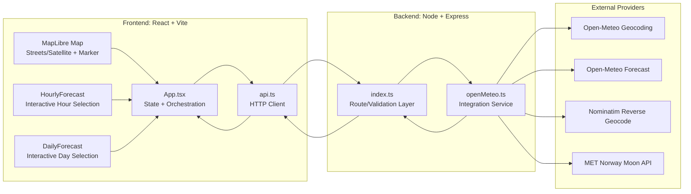
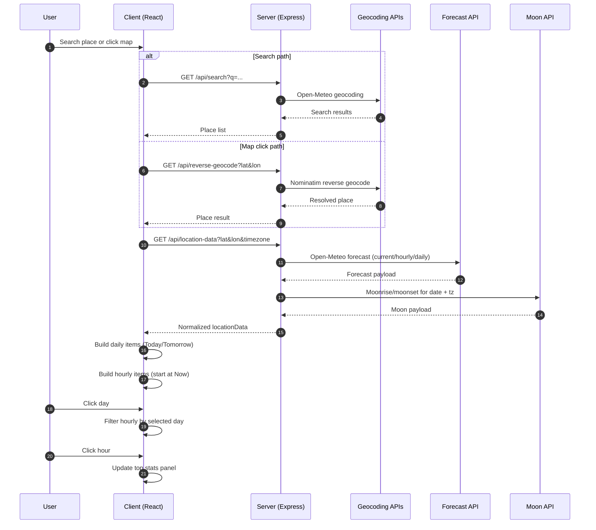

# Project Architecture

## Overview

This repository is a monorepo with two workspaces:

- `client`: React + Vite frontend for map interaction and weather visualization.
- `server`: Node.js + Express backend that proxies and composes weather/geocoding data from third-party APIs.

The app lets users pick a location from map click or search, then view current conditions, hourly forecast, and 10-day forecast with local-time formatting and timezone override options.

## Architecture Diagram

### Interaction and Data Flow

## Repository Structure

- `package.json`: root workspace configuration and combined scripts.
- `client/`: frontend app.
- `server/`: backend API service.

### Frontend (`client`)

- `client/src/main.tsx`: React entrypoint and global stylesheet imports.
- `client/src/App.tsx`: top-level orchestration for map lifecycle, search, selected location, forecast selection, and timezone handling.
- `client/src/api.ts`: HTTP client for backend endpoints.
- `client/src/types.ts`: shared frontend data types.
- `client/src/components/HourlyForecast.tsx`: interactive hourly strip.
- `client/src/components/DailyForecast.tsx`: interactive daily list.
- `client/src/components/WeatherIcon.tsx`: weather code to icon mapping.
- `client/src/styles.css`: global and component styles.

### Backend (`server`)

- `server/src/index.ts`: Express app, route definitions, request validation, and error handling.
- `server/src/services/openMeteo.ts`: integration layer for forecast, geocoding, reverse geocoding, and moon data.
- `server/src/types.ts`: backend response/data interfaces.

## Runtime Architecture

## 1) Presentation Layer (React)

The React app maintains UI and interaction state:

- Selected place and map marker.
- Loaded weather payload.
- Selected day and selected hourly slot.
- Timezone mode (location, user local, UTC, custom).

It renders:

- Left panel: controls + weather details + forecast widgets.
- Right map area: MapLibre map with streets/satellite styles.

## 2) API Layer (Frontend HTTP)

`client/src/api.ts` exposes typed calls:

- `searchPlaces(query)` -> `/api/search`
- `getLocationData(lat, lon, timezone)` -> `/api/location-data`
- `reverseGeocode(lat, lon)` -> `/api/reverse-geocode`

This keeps transport details separate from UI logic.

## 3) Service Layer (Express)

`server/src/index.ts` performs:

- Query parsing and validation (`lat`, `lon`, `q`, etc.).
- Calls to service methods in `openMeteo.ts`.
- Consistent JSON response and 4xx/5xx handling.

## 4) Integration Layer (External APIs)

`server/src/services/openMeteo.ts` calls:

- Open-Meteo Geocoding API (search)
- Open-Meteo Forecast API (current + hourly + daily)
- Nominatim reverse geocoding
- MET Norway moonrise/moonset API

Backend composes these into one normalized payload so frontend does not manage multiple providers directly.

## Data Flow

## A) Search-based selection

1. User types in search.
2. Frontend debounces input and calls `/api/search`.
3. User picks a result.
4. Frontend calls `/api/location-data`.
5. Backend fetches and merges forecast + astronomy data.
6. Frontend updates panel and map marker.

## B) Map-click selection

1. User clicks map.
2. Frontend calls `/api/reverse-geocode`.
3. If successful, resolved place is used; otherwise fallback pinned location is used.
4. Frontend calls `/api/location-data` for that coordinate.
5. Forecast panels and top stats refresh.

## C) Forecast interactions

1. User clicks a day in daily forecast.
2. Hourly strip is filtered to that selected day.
3. For current day, past hours are excluded and first visible slot is labeled "Now".
4. User clicks an hour.
5. Top stats section updates to reflect that selected hour.

## D) Timezone behavior

- Default display timezone is the selected location timezone.
- User can switch display timezone to local, UTC, or custom IANA timezone.
- Hour/day labels and sun/moon times are rendered in the active display timezone.

## API Surface (Backend)

- `GET /api/health`
- `GET /api/search?q=<query>`
- `GET /api/reverse-geocode?lat=<number>&lon=<number>`
- `GET /api/location-data?lat=<number>&lon=<number>&timezone=<string>`

## Location Data Contract

`/api/location-data` returns:

- `location`: latitude, longitude, timezone
- `current`: current weather fields
- `hourly`: per-hour arrays (`time`, `temperature_2m`, `weather_code`, etc.)
- `daily`: per-day arrays (`time`, `weather_code`, `sunrise`, `sunset`, plus moonrise/moonset)

The frontend treats these arrays as aligned by index.

## State and Interaction Model (Frontend)

Core state in `App.tsx` includes:

- Search/query state
- Selected place
- Loaded `locationData`
- Selected day index
- Selected hour key
- Timezone mode and custom timezone
- Map style mode (streets/satellite)

Derived view models are computed with memoized logic:

- Daily forecast items (Today/Tomorrow + formatted day labels)
- Hourly forecast items (filtered by selected day and current-time rule)
- Selected slot summary for top stats grid

## Build and Run

Root scripts:

- `npm run dev:client`
- `npm run dev:server`
- `npm run build`

Build compiles backend TypeScript and frontend Vite bundle.

## Design Rationale

- Monorepo workspaces simplify local development and shared versioning.
- Backend integration layer isolates third-party API differences and CORS/headers/policy handling.
- Frontend remains focused on interaction, formatting, and visualization.
- Forecast widgets are componentized for maintainability while selection state remains centralized in `App.tsx` for coordinated behavior.
